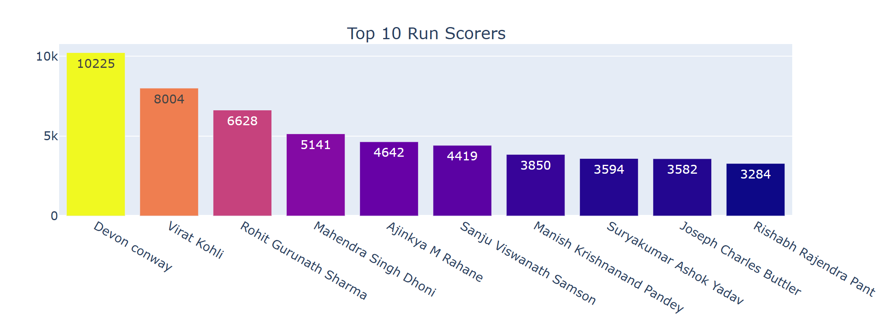
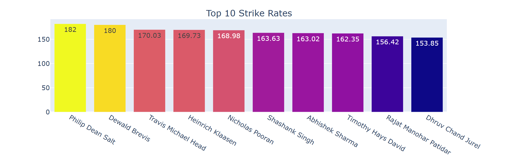

# IPL Cricket Analytics Dashboard

## Description
This project analyzes IPL player performance using Python and visualizes data.

## Features
- Top run scorers
- Strike rate comparison
- Batting average analysis

## Technologies Used
- Python
- Pandas
- Matplotlib
- Seaborn
- Plotly

## Output

## Skills Demonstrated
- Data Analysis
- Data Visualization
- Python Programming

## Conclusion
This project gives insights into player performance.
